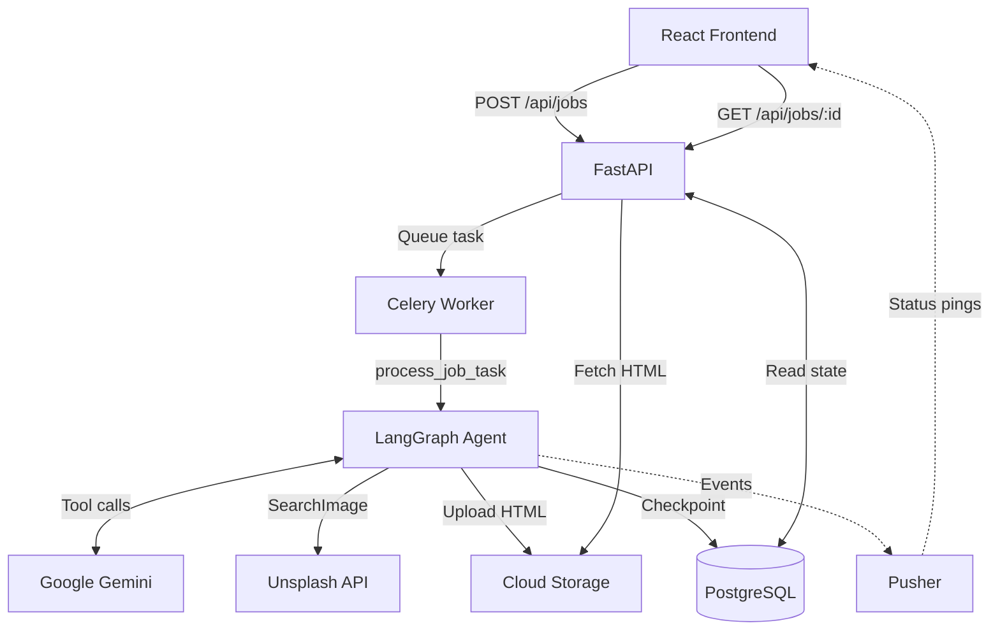
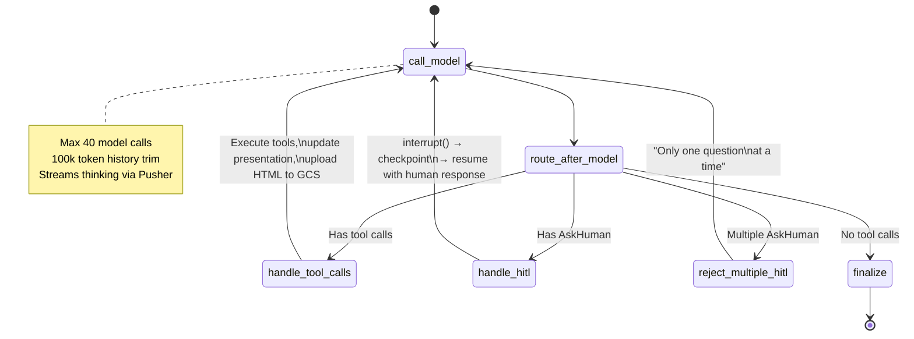
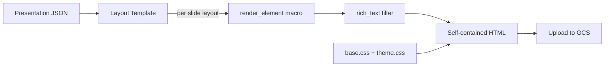
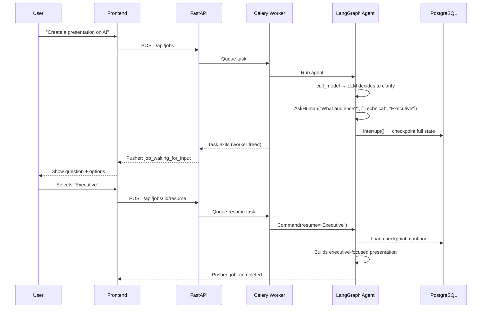
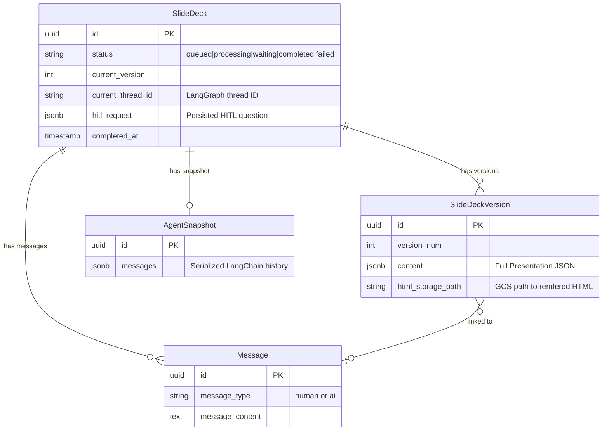

# Slidely

**AI-powered presentation generation platform** built on a LangGraph agentic loop, FastAPI, and a structured rendering pipeline.

The LLM never writes HTML. It manipulates a typed JSON schema through tool calls, and a Jinja2 template engine compiles that schema into pixel-perfect, themeable slides. This separation — structured data in, deterministic HTML out — is the core architectural decision behind Slidely.

**Key capabilities:**

- **Agentic tool-use loop** — the LLM builds presentations incrementally via 12 typed tools (create, edit, reorder, search images, set themes)
- **Human-in-the-loop** — the agent can pause mid-generation to ask clarifying questions, checkpoint its state to PostgreSQL, and resume exactly where it left off
- **Progressive rendering** — slides appear in real-time as the agent builds them, uploaded to GCS after each tool execution
- **Versioned output** — every generation creates a new version; follow-up edits build on the previous version's context

---

## Architecture Overview



**Five Docker services** orchestrate the system:

| Service | Role |
|---------|------|
| `web` | FastAPI app — REST API, Alembic migrations on startup |
| `worker` | Celery worker (solo pool) — runs the LangGraph agent |
| `frontend` | React dev server (Vite) — chat UI + slide preview |
| `db` | PostgreSQL 16 — state, versions, checkpoints |
| `redis` | Redis 7 — Celery broker + result backend |

---

## Agent State Machine

The core of Slidely is a LangGraph state machine that loops between LLM calls and tool execution until the presentation is complete.



**How it works:**

1. **`call_model`** — Trims message history to 100k tokens, invokes Gemini with all 12 tools bound. Streams thinking/reasoning chunks to Pusher for real-time UI.
2. **`route_after_model`** — Inspects the response. Tool calls? Execute them. AskHuman? Pause for user input. Plain text? Finalize.
3. **`handle_tool_calls`** — Executes each tool against the in-memory `Presentation` model, renders HTML via Jinja2, uploads to GCS. Emits `slides_updated` ping via Pusher.
4. **`handle_hitl`** — Calls `interrupt()` which checkpoints the full graph state to PostgreSQL. The Celery worker exits. When the user responds, a new worker resumes from the checkpoint via `Command(resume=value)`.
5. **`finalize`** — Packages the completed presentation. Job processor saves a versioned snapshot and marks the job complete.

---

## Why Structured JSON + Jinja2, Not Raw HTML?

Most AI slide generators ask the LLM to produce HTML directly. This is fragile. Here's why Slidely uses a **two-phase compiler approach** instead:

> **The LLM is the frontend** (generates structured intermediate representation).
> **Jinja2 is the backend** (compiles IR to target code).
> Neither needs to know about the other's internals.

| Concern | Raw HTML Generation | Structured JSON + Jinja2 |
|---------|---------------------|--------------------------|
| **Validation** | None until browser renders | Pydantic validates every tool call at execution time |
| **Consistency** | Varies per generation — different class names, nesting, whitespace | Same template, same output. Deterministic rendering |
| **Theming** | Must regenerate all HTML to change colors | Swap a CSS file. JSON stays untouched |
| **Editing** | Parse HTML with regex/DOM to find and modify content | Patch a JSON field. `EditElement(slide_id, element_id, content=...)` |
| **Progressive rendering** | Need complete HTML before displaying anything useful | Each tool call produces valid, renderable state |
| **Token efficiency** | LLM wastes ~3x tokens on HTML boilerplate per slide | Compact JSON. Templates handle all markup |

**Practical impact:** When a user says "change the title on slide 3", the agent calls `EditElement` with the new text. The Jinja2 template re-renders that slide. No HTML parsing, no risk of breaking adjacent slides, no wasted tokens regenerating the entire deck.

---

## Rendering Pipeline



**6 layout templates:** `title`, `content`, `section_header`, `two_column`, `image_text`, `blank`

**3 themes via CSS custom properties:**
- `default` — Corporate navy (#1e3a6e), blue-gray backgrounds
- `dark` — Pure black & white, minimal borders
- `modern` — Emerald green (#059669) gradients on warm neutrals

**Rich text:** All content passes through a `rich_text` Jinja2 filter powered by [mistune](https://github.com/lepture/mistune), converting inline markdown (`**bold**`, `*italic*`, `` `code` ``, `[links](url)`) to HTML.

**Output:** A single self-contained HTML string — `<style>` block with all CSS + slide `<div>`s. No external dependencies. Drop it in an iframe and it renders.

---

## Presentation Schema — JSON Example

The LLM builds this structure incrementally via tool calls. Every field is validated by Pydantic before it touches the template engine.

```json
{
  "title": "AI in Healthcare",
  "theme": "modern",
  "slides": [
    {
      "id": "slide-1",
      "layout": "title",
      "elements": [
        { "id": "el-1", "type": "title", "content": "AI in Healthcare" },
        { "id": "el-2", "type": "subtitle", "content": "Transforming patient outcomes with intelligent diagnostics" }
      ],
      "notes": "Welcome the audience. Frame AI as an augmentation tool, not a replacement."
    },
    {
      "id": "slide-2",
      "layout": "image_text",
      "elements": [
        { "id": "el-1", "type": "heading", "content": "AI-Powered Diagnostics" },
        {
          "id": "el-2",
          "type": "image",
          "content": "https://images.unsplash.com/photo-1576091160550-2173dba999ef",
          "metadata": { "alt": "Doctor reviewing medical scans on monitor" },
          "style": { "border_radius": "12px", "opacity": 0.95 }
        },
        {
          "id": "el-3",
          "type": "text",
          "content": "Real-time analysis of radiology scans with **94.5% accuracy**",
          "style": { "font_size": "20px", "color": "#059669" }
        }
      ],
      "notes": "Source: Stanford Medical AI Lab, 2024 study."
    },
    {
      "id": "slide-3",
      "layout": "content",
      "elements": [
        { "id": "el-1", "type": "heading", "content": "Key Applications" },
        {
          "id": "el-2",
          "type": "bullets",
          "content": [
            "**Medical imaging** — radiology, pathology, dermatology",
            "**Drug discovery** — molecule screening in hours, not months",
            "**Clinical workflows** — automated triage and documentation",
            "**Predictive analytics** — early detection of patient deterioration"
          ]
        }
      ],
      "notes": "Each bullet maps to a $10B+ market segment."
    }
  ]
}
```

### What the rendered HTML looks like

For `slide-1` (title layout), the template renders elements sequentially — no styles set, so the theme CSS handles everything:

```html
<div class="slide slide-title" data-slide-id="slide-1">
  <h1 class="slide-main-title" data-element-id="el-1">AI in Healthcare</h1>
  <p class="slide-subtitle" data-element-id="el-2">
    Transforming patient outcomes with intelligent diagnostics
  </p>
</div>
```

For `slide-2` (image_text layout with style overrides), the `element_style()` macro reads each field from the JSON `style` object and emits inline CSS — here giving the image rounded corners and the text a custom color:

```html
<div class="slide slide-image-text" data-slide-id="slide-2">
  <h2 class="slide-heading" data-element-id="el-1">AI-Powered Diagnostics</h2>
  <div class="slide-image" data-element-id="el-2"
       style="border-radius: 12px;opacity: 0.95;">
    
  </div>
  <p class="slide-text" data-element-id="el-3"
     style="font-size: 20px;color: #059669;">
    Real-time analysis of radiology scans with <strong>94.5% accuracy</strong>
  </p>
</div>
```

For `slide-3` (content layout), the heading renders at top, body content goes in a flex-constrained wrapper, and the `rich_text` filter converts `**bold**` markdown to `<strong>`:

```html
<div class="slide slide-content" data-slide-id="slide-3">
  <h2 class="slide-heading" data-element-id="el-1">Key Applications</h2>
  <div class="slide-body">
    <ul class="slide-bullets" data-element-id="el-2">
      <li><strong>Medical imaging</strong> — radiology, pathology, dermatology</li>
      <li><strong>Drug discovery</strong> — molecule screening in hours, not months</li>
      <li><strong>Clinical workflows</strong> — automated triage and documentation</li>
      <li><strong>Predictive analytics</strong> — early detection of patient deterioration</li>
    </ul>
  </div>
</div>
```

Three rendering features at work: **inline styles** from the `element_style()` macro (slide-2's `border-radius`, `opacity`, `color`), **layout-specific structure** from per-layout templates (slide-3's `slide-body` wrapper), and **rich text** from the mistune `rich_text` filter (`**bold**` → `<strong>`).

---

## Tool System

The LLM interacts with presentations exclusively through typed Pydantic tool schemas. It never sees or generates HTML.

| Category | Tool | Purpose |
|----------|------|---------|
| **Slide Ops** | `CreateSlide` | Add a new slide with layout + elements |
| | `EditSlide` | Full rewrite of a slide's elements/layout |
| | `EditElement` | Patch a single element (content, style, metadata) |
| | `AddElement` | Insert element at position or append |
| | `RemoveElement` | Delete a single element |
| | `DeleteSlide` | Remove an entire slide |
| | `ReorderSlides` | Change slide order |
| | `SetTheme` | Apply theme + optional custom CSS |
| **Media** | `SearchImage` | Query Unsplash API, return a real image URL |
| **HITL** | `AskHuman` | Pause and ask the user a clarifying question |
| **Knowledge** | `LoadSkill` | Load full instructions for a skill (e.g., slide design best practices) |
| | `ReadSkillFile` | Read a reference file within a skill directory |

**Execution model:** Tools are Pydantic schemas bound to the LLM via `bind_tools()`. When the LLM calls a tool, the executor validates the arguments, mutates the in-memory `Presentation` model, and returns a text result. The presentation is then serialized back into the graph state. The LLM only ever sees JSON manipulation results — never raw HTML.

---

## Human-in-the-Loop (HITL) Flow

The agent can pause mid-generation to ask clarifying questions, with full state preserved across the interruption.



**Key design insight:** The Celery worker is completely stateless between interrupt and resume. PostgreSQL checkpointing (via LangGraph's `AsyncPostgresSaver`) is the only state bridge. Workers can restart, scale, or crash — the agent resumes from the last checkpoint.

---

## Skills System — Progressive Disclosure

The agent has access to design knowledge through a tiered skill system that optimizes for token efficiency:

```
Tier 1: Catalog (always in system prompt)     ~50 tokens/skill
   └─ Skill names + one-line descriptions

Tier 2: Full Instructions (on-demand)         ~2,000 tokens
   └─ LoadSkill("slide_design") → SKILL.md body

Tier 3: Reference Files (on-demand)           ~500-2,000 tokens each
   └─ ReadSkillFile("slide_design", "refs/design_recipes.md")
```

**Available skills:**
- `slide_design` — Layout specs, element schemas, design recipes (9 ready-to-use patterns), deck templates
- `slide_editing` — Editing strategies with before/after tool call examples

The agent only loads knowledge when it needs it. For a simple 5-slide deck, it might never go past Tier 1. For a complex redesign, it loads specific reference files. This keeps the context window lean — the agent doesn't pay for knowledge it doesn't use.

**Zero-code extensibility:** Drop a folder with `SKILL.md` into `skills/` and it auto-registers in the catalog.

---

## Database Schema



**Dual-storage pattern:**
- **AgentSnapshot** stores the full LangChain message history (system prompts, tool calls, tool results, AI responses). This is injected into subsequent runs for follow-up context — the agent remembers the entire conversation.
- **SlideDeckVersion** stores the client-facing output: the Presentation JSON and a GCS path to rendered HTML. Each generation creates a new version.

---

## API

| Method | Endpoint | Purpose |
|--------|----------|---------|
| `POST` | `/api/jobs` | Create a new presentation or send a follow-up on a completed one |
| `POST` | `/api/jobs/{id}/resume` | Resume a HITL-paused job with the user's response |
| `GET` | `/api/jobs/{id}` | Full job state: status, messages, slides HTML, HITL request |

The `GET` endpoint is the single source of truth for the frontend. During `PROCESSING` status, it returns in-progress HTML from the next version's GCS path — enabling live preview as the agent works.

---

## Project Structure

```
.
├── app/
│   ├── api/routes.py                  # FastAPI endpoints (3 routes)
│   ├── core/
│   │   ├── config.py                  # Pydantic Settings (env vars)
│   │   └── schemas/presentation.py    # Presentation → Slide → SlideElement models
│   ├── db/
│   │   ├── models.py                  # SQLAlchemy: SlideDeck, Version, Message, Snapshot
│   │   ├── managers/                  # Thin ORM wrappers (version, message, snapshot)
│   │   └── session.py                 # Session with callback-after-commit pattern
│   └── services/
│       ├── job_processor.py           # Celery entry: orchestrates full job lifecycle
│       ├── slide_agent.py             # Composition root: builds LLM + tools + graph
│       ├── slide_renderer.py          # JSON → HTML via Jinja2 templates
│       ├── storage.py                 # GCS upload/download abstraction
│       ├── image_search.py            # Unsplash API integration
│       ├── pusher.py                  # Real-time event pings
│       ├── celery_app.py              # Celery configuration
│       ├── tasks.py                   # Celery task definition
│       └── orchestration/
│           ├── graph/
│           │   ├── graph.py           # LangGraph state machine (5 nodes)
│           │   ├── tools.py           # 12 tool schemas + executors
│           │   ├── state.py           # AgentState TypedDict
│           │   └── streaming.py       # Selective thought streaming to Pusher
│           ├── config.py              # Agent config (limits, prompt paths)
│           └── skills.py              # Skill store with progressive disclosure
├── templates/slides/
│   ├── _macros.html.j2               # Shared render_element() dispatch macro
│   ├── title.html.j2                 # Title slide layout
│   ├── content.html.j2              # Content layout (heading + body)
│   ├── section_header.html.j2       # Section transition layout
│   ├── two_column.html.j2           # Two-column comparison layout
│   ├── image_text.html.j2           # Image + text side-by-side layout
│   ├── blank.html.j2               # Freeform layout
│   └── themes/
│       ├── base.css                  # Core: 960x540 canvas, flexbox, typography
│       ├── default.css              # Corporate navy theme
│       ├── dark.css                 # Black & white minimal theme
│       └── modern.css               # Emerald green contemporary theme
├── skills/
│   ├── slide_design/                # Design knowledge (layouts, recipes, templates)
│   └── slide_editing/               # Editing strategies with examples
├── prompts/
│   ├── system_prompt.j2             # Agent persona, design philosophy, workflow
│   └── user_prompt.j2              # Date, context, current slides, user query
├── AasumSlidely/                    # React frontend (Vite + Zustand + Pusher)
├── docker-compose.yml               # Full stack: web, worker, frontend, db, redis
└── alembic/                         # Database migrations
```

---

## Tech Stack

| Layer | Technology | Purpose |
|-------|-----------|---------|
| LLM | Google Gemini (via LangChain) | Content generation + tool calling |
| Agent Framework | LangGraph | State machine with PostgreSQL checkpointing |
| Backend | FastAPI + Uvicorn | REST API with async support |
| Task Queue | Celery + Redis | Async job processing (solo pool) |
| Database | PostgreSQL 16 | State, versions, agent checkpoints |
| Object Storage | Google Cloud Storage | Rendered HTML persistence |
| Real-time | Pusher | Lightweight WebSocket event pings |
| Templating | Jinja2 + mistune | Structured JSON → HTML rendering |
| Image Search | Unsplash API | Real photography for slides |
| Frontend | React + Vite + Zustand | Chat UI + live slide preview |
| Containerization | Docker Compose | Full-stack orchestration (5 services) |

---

## Getting Started

**Prerequisites:** Docker must be running on your machine. You also need API keys for Google Cloud (Gemini + GCS), Pusher, and Unsplash.

```bash
# Clone and configure
git clone <repo-url> && cd SlidelyAssignment
cp .env.example .local.env
# Fill in: GOOGLE_APPLICATION_CREDENTIALS, GCS_BUCKET_NAME, PUSHER_*, UNSPLASH_ACCESS_KEY
```

The project ships with a `slidely` CLI that wraps Docker Compose:

```bash
./slidely start      # Build and start all 5 services
./slidely stop       # Stop everything
./slidely restart    # Restart all services
./slidely logs       # Tail logs across all services
./slidely status     # Show service statuses
./slidely ngrok      # Expose frontend via ngrok (requires NGROK_DOMAIN in .local.env)
```

| Service | URL |
|---------|-----|
| Frontend | http://localhost:3000 |
| API | http://localhost:9753 |
| API Docs | http://localhost:9753/docs |
